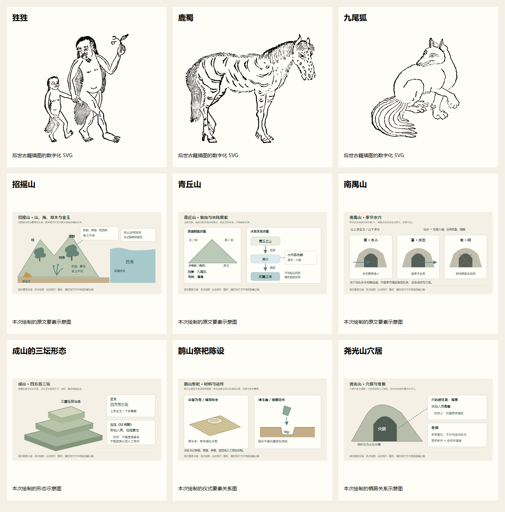
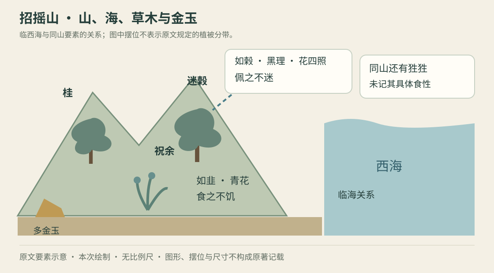
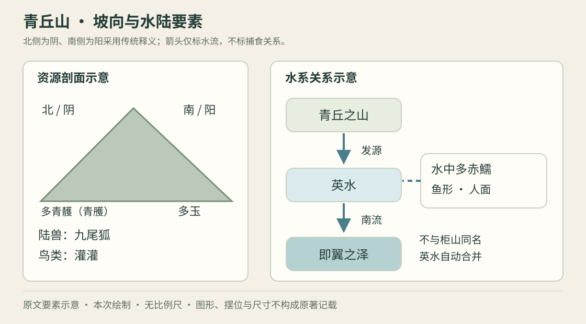
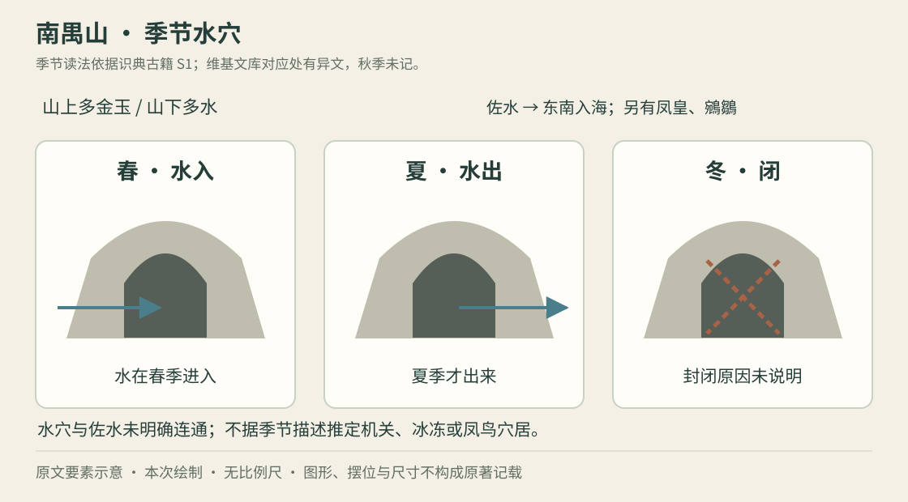
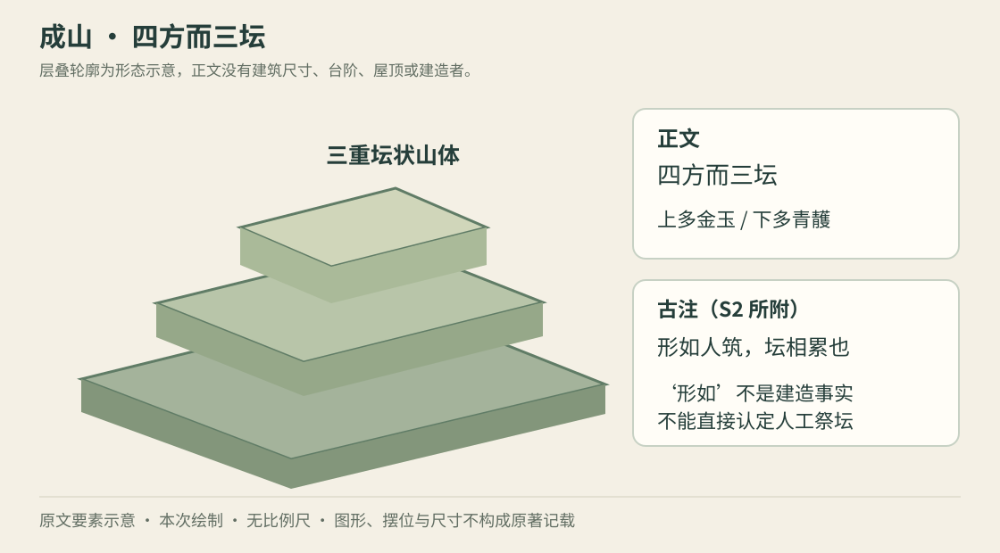
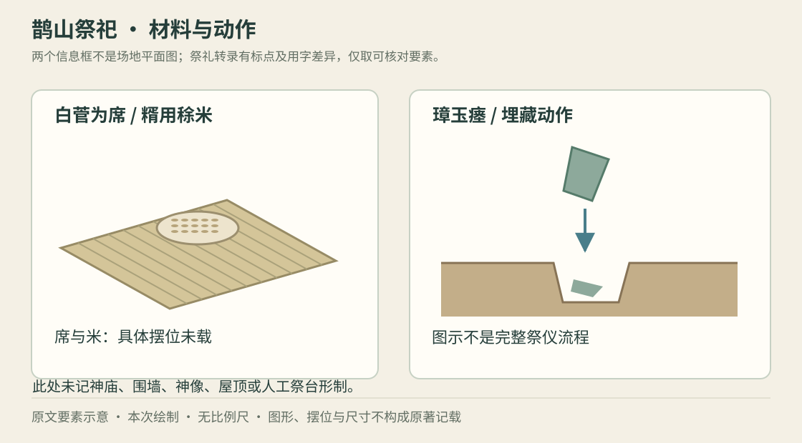
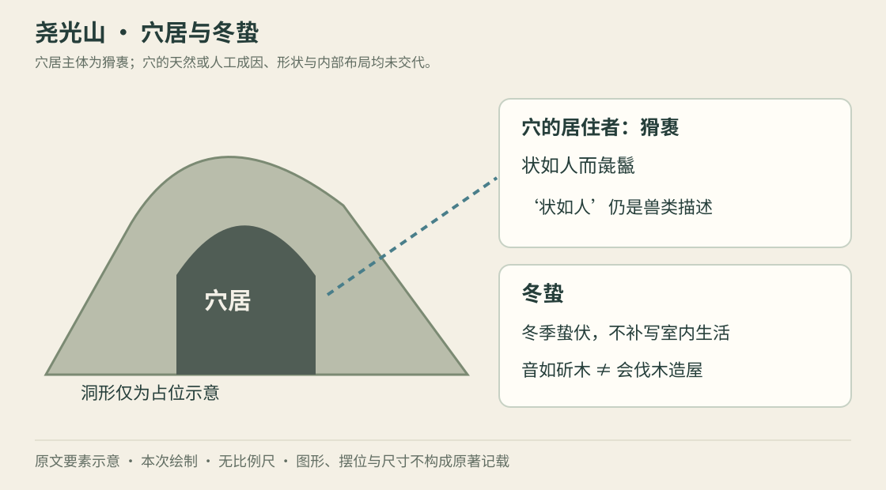

# 南山经原著图文资料 · 首批九项

整理日期：2026-10-08。范围：《山海经》卷一《南山经》，包括南山经之首、南次二经、南次三经。

**范围说明：** 异兽与生态各三项；建筑类改以三项建筑与空间线索呈现。《南山经》未提供三座具名建筑的明确形制资料，不能将三坛地形、祭仪陈设或异兽穴居直接当作人造建筑。

[打开图文浏览版](南山经图文资料.html) · [结构化资料卡](资料卡.json) · [图片来源与校验清单](图片来源.json)

## 阅读与取材方法

正文以 S1 在线转录为主，繁体引文保留其用字；标点作阅读整理，省略处用‘……’明示。解释与资料卡名称用简体，均为本次整理。S2 用于交叉核对和辨认古注；这份资料是有出处的初步整理，不宣称完成底本影印校勘。

三张异兽图是后世古籍插图的数字化版本，不能称为《山海经》成书时的原始图像。六张生态与空间图为本次绘制的要素示意，图中尺寸、形状、摆位、颜色不超越正文成为历史事实。后世插图与本次示意均单独标注图像性质。

卡片分为正文引文、释读、可确认要素、古注／异文／边界、模组原创候选。最后一项只供改编讨论，不表示已确认开发内容。‘生态’在此指同山环境、物产、水系和栖居记载的组合，不预设现代生态学意义的食物链。

## 九项总览

总览为九张配图的浏览器渲染缩略表，供快速浏览；完整细节与图源见各卡片。更新图片后需重新导出这张预览。

| 类别 | 三项 | 图像性质 |

| --- | --- | --- |

| 异兽 | 狌狌、鹿蜀、九尾狐 | 后世古籍插图 |

| 生态 | 招摇山、青丘山、南禺山 | 原文要素示意 |

| 建筑与空间线索 | 成山三坛、鹊山祭祀、尧光山穴居 | 形态／仪式／栖居示意；不能据此称为三座建筑 |

## 异兽 · 三项

### 狌狌：白耳与两种行走姿态

定位：**南山经之首 · 招摇之山**。[S1 · 识典古籍 · 山海经 · 南山经第一](https://www.shidianguji.com/zh/book/SBCK099/chapter/SBCK099_3)；招摇之山条，检索‘其名曰狌狌’。

图注：据 Commons 文件页：明代《山海经图》、胡文焕相关插图。为后世图像解释，非原始山海图。 [图像来源](https://commons.wikimedia.org/wiki/File:南山經-狌狌.svg)

**正文引文**

> 有獸焉，其狀如禺而白耳，伏行人走，其名曰狌狌，食之善走。

**释读**

山中有兽，形似禺，长着白耳，既伏行又能像人一样行走，名为狌狌；经文说食用它可以使人善于奔走。

**可确认要素**

- 形态：如禺；白耳。
- 动作：伏行、人走。
- 效用：‘食之善走’描述食用者的效果。

**古注、异文与取材边界**

- ‘禺’的具体形态不能只靠正文确定。S2 所附古注将其解释为似猕猴的兽；本卡不把狌狌直接等同现代猩猩。
- 图中拟人面貌、手持植物和幼体组合属于后世绘图细节，不构成这段正文的持物或亲子行为依据。
- 正文没有记载狌狌会说话、饮酒、带路，也未把‘善走’明说成它自身的速度能力。

**模组原创候选（非正文）**

模组原创候选：以白耳作识别特征，用伏行与直立观察两种动作体现差异；具体食性、驯服和带路行为另行设计。

### 鹿蜀：马形、白首、虎纹、赤尾

定位：**南山经之首 · 杻阳之山**。[S1 · 识典古籍 · 山海经 · 南山经第一](https://www.shidianguji.com/zh/book/SBCK099/chapter/SBCK099_3)；杻阳之山条，检索‘其名曰鹿蜀’。

图注：后世黑白插图可供轮廓参考；白首和赤尾等颜色仍应回到经文确认。 [图像来源](https://commons.wikimedia.org/wiki/File:南山經-鹿蜀.svg)

**正文引文**

> 有獸焉，其狀如馬而白首，其文如虎而赤尾，其音如謡，其名曰鹿蜀，佩之宜子孫。

**释读**

有兽形似马，头白、身有虎纹、尾赤，声音像歌谣，名为鹿蜀；经文说佩用它有利于子孙。

**可确认要素**

- 基础轮廓为马，名字中的‘鹿’不构成鹿角依据。
- 白首、虎纹、赤尾是正文明确的造型特征。
- 叫声如谣；效用为‘佩之宜子孙’，并非‘食之’。

**古注、异文与取材边界**

- 正文只说‘佩之’，没有说明如何制作佩物。S2 古注解释为带其皮尾，应与正文分层记录。
- 繁育加成、掉落材料、群居和坐骑能力都不是这段正文的直接记载。

**模组原创候选（非正文）**

模组原创候选：用马形轮廓配白头、虎纹和红尾，声音设计参考歌谣感；若制作繁育佩物，明确标注效果与取得方式为改编。

### 九尾狐：狐形九尾与婴儿般的声音

定位：**南山经之首 · 青丘之山**。[S1 · 识典古籍 · 山海经 · 南山经第一](https://www.shidianguji.com/zh/book/SBCK099/chapter/SBCK099_3)；青丘之山条，检索‘其狀如狐而九尾’。

图注：后世古籍插图表现狐体与多尾，造型依据仍以‘如狐而九尾’为准。 [图像来源](https://commons.wikimedia.org/wiki/File:南山經-九尾狐.svg)

**正文引文**

> 有獸焉，其狀如狐而九尾，其音如嬰兒，能食人，食者不蠱。

**释读**

有兽形似狐而有九尾，声音像婴儿，能够食人；经文又说食用它可以不受蛊害。

**可确认要素**

- 正文描述狐形、九尾，没有规定毛色。
- 声音像婴儿；‘能食人’明确。
- 此条正文没有‘其名曰九尾狐’，本卡使用通行称名。

**古注、异文与取材边界**

- ‘不蛊’的具体解释有分歧；S2 夹注有妖邪之气、蛊毒两种解释，不能直接改写为现代医学功效。
- 化人、魅惑、幻术、修炼等级及狐族宫殿均未在本段出现。

**模组原创候选（非正文）**

模组原创候选：用九尾剪影和婴儿般的叫声形成可观察线索；诱导声源、幻象和战斗方式需要另标原创。

## 生态 · 三项

### 招摇山：滨海山地的奇草、异木与矿物

定位：**南山经之首 · 招摇之山**。[S1 · 识典古籍 · 山海经 · 南山经第一](https://www.shidianguji.com/zh/book/SBCK099/chapter/SBCK099_3)；开篇招摇之山条，检索‘祝餘’与‘迷榖’。

图注：示意图展示同条记载的要素及滨海关系，不代表实测地图或已考证生态复原。

**正文引文**

> 其首曰招摇之山，臨于西海之上，多桂，多金玉。有草焉，其狀如韭而青花，其名曰祝餘，食之不飢。有木焉，其狀如榖而黑理，其花四照，其名曰迷榖，佩之不迷。

**释读**

招摇山临西海，多桂和金玉。祝余形似韭、开青花，记有食后不饥之效；迷榖形似榖、纹理黑、花四照，记有佩后不迷之效。

**可确认要素**

- 环境：临西海的山地；正文未定气候带。
- 植物：桂、祝余、迷榖，草木形态与效用各有描述。
- 同一山条还记狌狌、水流入海及育沛。

**古注、异文与取材边界**

- 图中草、树、矿与海的具体摆位是示意；正文未指定植物在山顶、山腰或山脚的分带。
- ‘桂’不宜未经说明直接画成现代观赏桂花；‘青花’不强行指定蓝色或绿色。
- 植物效用属于古籍记载；不把它们当作现实食用或治疗建议，也不据此虚构食物链。

**模组原创候选（非正文）**

模组原创候选：作为初次考察山域，安排祝余采集与迷榖识别；分布密度、发光实现和具体导航机制另作玩法设计。

### 青丘山：山阴山阳、河流与水陆异物

定位：**南山经之首 · 青丘之山**。[S1 · 识典古籍 · 山海经 · 南山经第一](https://www.shidianguji.com/zh/book/SBCK099/chapter/SBCK099_3)；青丘之山条，检索‘英水出焉’。

图注：山阴／山阳和向南流的水系示意；灌灌、赤鱬只以名称标注，不补绘未经正文核定的细节。

**正文引文**

> 又東三百里，曰青丘之山。其陽多玉，其陰多青䨼。……有鳥焉，其狀如鳩，其音若呵，名曰灌灌，佩之不惑。英水出焉，南流注于即翼之澤。其中多赤鱬，其狀如魚而人面，其音如鴛鴦，食之不疥。

**释读**

青丘山的阳面多玉，阴面多青䨼；有灌灌鸟及前卡所列九尾狐。英水从这里发源，向南流入即翼泽，水中多赤鱬。

**可确认要素**

- 资源有山阴、山阳的差别，图按山南为阳、山北为阴示意。
- 水系方向明确：青丘 → 英水 → 南流 → 即翼泽。
- 陆兽、鸟和水中异鱼在同一条出现，但没有明言互相捕食。

**古注、异文与取材边界**

- 引文省略的九尾狐部分已在异兽卡完整引用，省略号为本次整理所加。
- S1 作‘青䨼’，S2 作‘青雘’，本卡显示名保留异文，可理解为青色矿物／颜料线索，不直接指定铜矿或某一种现代矿物。
- 本条英水不要与南次二经柜山条同名、向西南流入赤水的英水混为一条。
- 正文没有狐国、王宫或具体森林类型；图中的连接只表示空间关系。

**模组原创候选（非正文）**

模组原创候选：以坡向资源和沿水探索组织场景，让声音线索分别来自兽、鸟、鱼；食物链与生成权重另行设计。

### 南禺山：有季节变化的山穴与水系

定位：**南次三经 · 南禺之山**。[S1 · 识典古籍 · 山海经 · 南山经第一](https://www.shidianguji.com/zh/book/SBCK099/chapter/SBCK099_3)；南次三经末条，检索‘水春輒入’。

图注：按 S1 绘制春、夏、冬三态；只画水与穴的关系，不补画秋季或封闭机制。

**正文引文**

> 東五百八十里，曰南禺之山。其上多金玉，其下多水。有穴焉，水春輒入，夏乃出，冬則閉。佐水出焉，而東南流注于海。有鳳皇、鵷鶵。

**释读**

南禺山上多金玉，下多水。有穴，水在春季进入、夏季出来、冬季闭塞；佐水发源于此，向东南入海，还有凤皇和鵷鶵。

**可确认要素**

- 空间分层：上多金玉，下多水。
- 季节线索：春入、夏出、冬闭；秋季没有交代。
- 水系：佐水向东南注海；山穴与佐水是否直接相通未明确。

**古注、异文与取材边界**

- 本卡季节文字依据 S1。S2 对应处作‘水出辄入’，故不能假装两个网页完全一致；要严谨复原时仍需核对底本影印。
- 正文没有说明冬闭缘由，不能确认为结冰、机关门或人为封堵。
- 本条仅说明有凤皇、鵷鶵，没有说明它们住在穴内，也没有建筑性‘凤巢’。

**模组原创候选（非正文）**

模组原创候选：做季节可观察的水穴入口；若加入季节循环、通行条件和宝藏，标明为改编并另定秋季规则。

## 建筑与空间线索 · 三项

### 成山的三坛形态：像叠坛的山体，不等于人工祭坛

定位：**南次二经 · 成山**。[S1 · 识典古籍 · 山海经 · 南山经第一](https://www.shidianguji.com/zh/book/SBCK099/chapter/SBCK099_3)；成山条，检索‘四方而三壇’。

图注：三层方整山体示意；非建筑复原图，也不作为人工遗址证据。

**正文引文**

> 又東五百里，曰成山，四方而三壇。其上多金玉，其下多青䨼。

**释读**

成山有方整、三重坛状的山体描述，上多金玉，下多青䨼。正文主语是山，不能仅据‘坛’字就认定它是一座人造祭坛。

**可确认要素**

- 正文明确：四方、三坛、上下资源差别。
- S2 所附古注：‘形如人築，壇相累也。成亦重耳’。
- 古注的‘形如’支持叠坛状形态，不能证成建造者和建筑用途。

**古注、异文与取材边界**

- 图中的三层大小、层高、坡度与材质均为抽象示意，原文没有尺寸。
- 没有阶梯、屋顶、柱廊、庙宇或祭坛朝向的正文依据；也未确立它对应现代哪一处遗址。

**模组原创候选（非正文）**

模组原创候选：把三重轮廓做成可辨认的地形；若添加台阶、祭器或遗迹，应单独标为原创建筑。

### 鹊山祭祀陈设：白菅席与瘗玉提供仪式空间线索

定位：**南山经之首 · 鹊山山系总述**。[S1 · 识典古籍 · 山海经 · 南山经第一](https://www.shidianguji.com/zh/book/SBCK099/chapter/SBCK099_3)；‘凡䧿山之首’总述，检索‘玉瘞’与‘白菅爲席’。

图注：两个分开的信息框表示席与瘗玉，并非祭祀场地的平面复原。

**正文引文**

> 其神狀皆鳥身而龍首。……用一璋玉瘞，糈用稌米，……白菅爲席。

**释读**

这段汇总山系的山神形态与祭礼，记有璋玉瘗埋、供祭之米以及白菅为席。它提供祭仪材料和动作线索，没有给出神庙建筑。

**可确认要素**

- 适用对象是鹊山山系山神；形态为鸟身龙首。
- 正文可摘取的材料与动作：璋玉、瘗、糈、稌米、白菅席。
- ‘瘗’为埋藏、‘糈’为祭神之米的说明参照 S2 夹注。

**古注、异文与取材边界**

- 本段标点、‘毛’与‘一壁／一璧稻米’等文字在网页转录中有差别。引文只摘取可对应的短句，省略号由本次整理加入，不拼成唯一礼仪流程。
- 不把‘毛’简单当作几根羽毛；古注涉及祭牲毛色。祭牲种类、完整数量和仪式顺序此处不作定论。
- 图中的席、米、玉与埋藏点摆位只是概念关系，没有原著平面布局依据；神像、围墙、屋顶、台阶与仪式触发机关均无正文依据。

**模组原创候选（非正文）**

模组原创候选：以席、玉与米做可辨认的祭仪道具组合；场所、完整配方、交互顺序与回报都需作为改编另写。

### 尧光山穴居：猾褢的栖居方式，不是人类洞宅

定位：**南次二经 · 尧光之山**。[S1 · 识典古籍 · 山海经 · 南山经第一](https://www.shidianguji.com/zh/book/SBCK099/chapter/SBCK099_3)；尧光之山条，检索‘穴居而冬蟄’。

图注：穴口与冬蛰仅作关系示意，洞形为占位，不代表实际尺寸或人造洞宅。

**正文引文**

> 又東三百四十里，曰堯光之山，其陽多玉，其陰多金。有獸焉，其狀如人而彘鬣，穴居而冬蟄，其名曰猾褢，其音如斫木，見則縣有大繇。

**释读**

尧光山阳面多玉、阴面多金。有兽形似人而有猪鬣，居穴并在冬季蛰伏，名为猾褢，声音像砍木；经文还把它出现与‘大繇’相联系。

**可确认要素**

- 穴居的主体是猾褢这种兽，不是人类。
- 正文给出穴居与冬蛰，可用于栖息空间线索。
- 正文没有交代穴为天然或挖掘形成，也未给出内部布局。

**古注、异文与取材边界**

- ‘音如斫木’是声音类比，不能推成会伐木造屋。
- S2 古注对‘大繇’有作役等解释，并录异说；本文不把它确定为修建某一座建筑。
- 洞门、居室、家具、雕刻、通道数量及人工支护均无正文依据；猾褢只作空间条目的主体说明，不增列为第四张异兽卡。

**模组原创候选（非正文）**

模组原创候选：以冬季蛰伏的穴居生物为探索线索；洞形、季节行为、音效范围和遭遇规则均需另行设计。

## 来源与版本记录

- **S1** [识典古籍 · 山海经 · 南山经第一](https://www.shidianguji.com/zh/book/SBCK099/chapter/SBCK099_3)：页面标示郭璞注、黄丕烈校勘；作为本次正文转录主查阅来源，非现代考证结论。

- **S2** [维基文库 · 山海经／南山经](https://zh.wikisource.org/w/index.php?title=山海經/南山經&oldid=2650929)：核对正文及夹注；本文只在明确标为古注处引用夹注。该页面南禺条作‘水出辄入’，与 S1 ‘水春辄入’不同。

- **S3** [中国哲学书电子化计划 · 南山经](https://ctext.org/shan-hai-jing/nan-shan-jing/ens)：补充查阅入口；本轮只检得搜索摘要，完整页面访问返回 403，未据此完成逐句校勘。

## 图片来源与使用说明

三张异兽 SVG 从 Wikimedia Commons 提供的原文件地址保存，未改动图形。文件说明页将来源标为明代《山海经图》及胡文焕，并标注 Public Domain／PD-Art／Public Domain Mark。本站记录中的具体作者年代未在本次独立考证，故不据其数字推定版本出版年。逐图来源页、下载地址、SHA-256 与尺寸见 [图片来源清单](图片来源.json)。

其余六张 SVG 为本项目绘制，不是历史插图或考古测绘，也不是具体建筑的复原。使用和改绘古籍图片时仍应保留图源说明，避免把后世画法说成正文规定的颜色或结构。

## 更新资料

编辑 `资料卡.json` 后运行 `python docs/南山经资料/生成图文.py`，同步生成 Markdown、HTML 和示意图。生成脚本只用 Python 标准库；古籍原图另行保存，不会由脚本重画。
